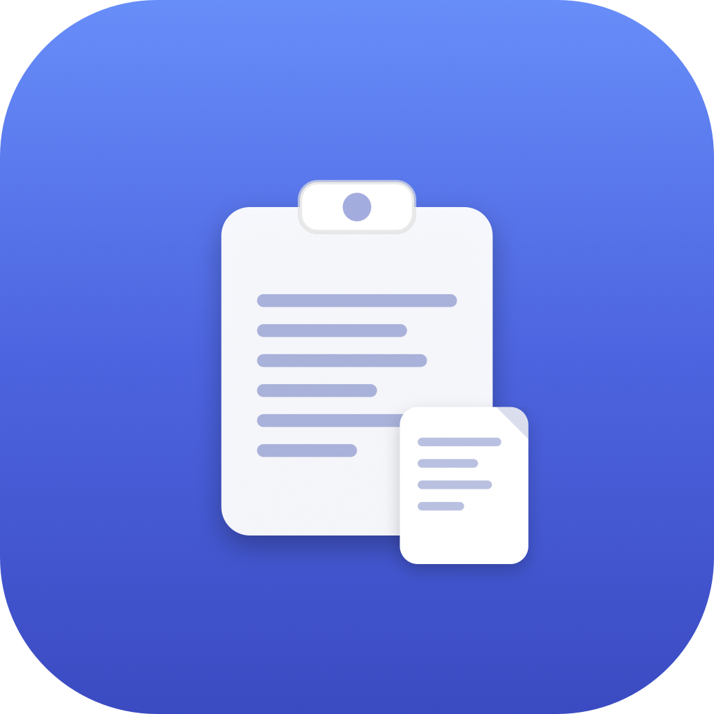
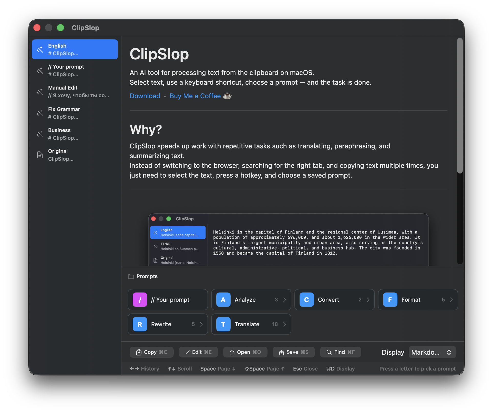

<p align="center">
  
</p>

<h1 align="center">ClipSlop</h1>

<p align="center">
  AI-powered clipboard processor for macOS.<br>
  Select text, press a shortcut, pick a prompt — done.
</p>

<p align="center">
  <a href="https://github.com/mekedron/ClipSlop/releases/latest">Download</a> &nbsp;·&nbsp;
  <a href="https://buymeacoffee.com/mekedron">Buy Me a Coffee ☕</a>
</p>

---

## Why?

Because copy-pasting text into ChatGPT for the 47th time today to translate / rewrite / summarize the same kind of stuff is not a workflow — it's a punishment. Open browser, find the tab, type the same prompt you typed yesterday, copy the result, switch back, paste. Repeat until insane.

ClipSlop exists so you never do that again. Select text, press a shortcut, pick a saved prompt, done. No browser. No "please make this shorter". No copy-paste Olympics.

---

<p align="center">
  
</p>

## What it does

ClipSlop sits in your menu bar and transforms any text through AI prompts. Grab text from anywhere — a browser, email, terminal — and run it through translation, reformatting, summarization, or your own custom prompts. All without leaving the app you're working in.

## Use cases

- **Translate on the fly** — Select a message, press `⌃⌘C`, pick a language. Paste the translation back.
- **Fix grammar before sending** — Write a draft, run it through "Fix Grammar", paste the clean version.
- **Make it professional** — Rewrite a casual message in business tone for that important email.
- **Summarize long text** — Paste a wall of text, get a TL;DR in seconds.
- **OCR from screen** — Capture text from images, screenshots, or non-selectable UI with `⇧⌘2`.
- **Chain transformations** — Translate → fix grammar → make formal. Each step is tracked in history.
- **Quick notepad** — Open a blank editor (`⌃⌘N`), write something, run it through any prompt.

## How it works

```
Select text → ⌃⌘C → Pick a prompt → Get result → Copy / Paste back
```

1. **Trigger** — Select text anywhere and press `⌃⌘C` (or use clipboard/OCR/blank editor)
2. **Choose** — Navigate the prompt tree with keyboard mnemonics (T for Translate, F for Format...)
3. **Process** — AI processes your text with streaming output
4. **Use** — Copy (`⌘C`), paste back, edit (`⌘E`), or chain another transformation
5. **History** — Every step is saved. Navigate with arrow keys, jump to any point.

## Features

- **Multi-provider AI** — Anthropic (Claude), OpenAI (GPT), Ollama (local), any OpenAI-compatible API
- **Nested prompt tree** — Organize prompts in folders with single-key mnemonics
- **Full history** — See every transformation step, navigate back and forth
- **Manual editing** — Edit any result by hand (`⌘E`), saved as a history step
- **Screen OCR** — Capture and recognize text from any screen region
- **Configurable shortcuts** — All global hotkeys are customizable
- **Generate prompts with AI** — Describe what you want, AI writes the system prompt
- **Import/Export** — Share prompt configurations as JSON
- **iCloud Sync** — Prompts sync across your Macs
- **Launch at login** — Always ready when you need it
- **Adjustable opacity** — Semi-transparent popup so you can see what's behind

## Default shortcuts

| Shortcut | Action |
|----------|--------|
| `⌃⌘C` | Trigger ClipSlop (selected text) |
| `⌃⌘V` | Process from clipboard |
| `⌃⌘N` | Blank editor |
| `⇧⌘2` | Screen capture (OCR) |
| `⌘E` | Edit mode |
| `⌘S` | Save to file |
| `⌘O` | Open in TextEdit |
| `⌘,` | Settings |
| `←→` | Navigate history |
| `↑↓` | Scroll text |
| `Space` | Page down |
| `Esc` | Close / Back |

## Install

### Download

Grab the latest `.dmg` from [Releases](https://github.com/mekedron/ClipSlop/releases/latest). Drag to Applications. On first launch, right-click → Open (unsigned app).

### Build from source

```bash
git clone https://github.com/mekedron/ClipSlop.git
cd ClipSlop
swift build
# Or open Package.swift in Xcode → Run
```

Requires macOS 14+ and Xcode with Swift 6.0+.

## Default prompts

```
[T] Translate → English, Finnish, Russian, Spanish, French, German, Chinese
[F] Format    → Fix Grammar, Business, Polite, Playful, Biblical
[A] Analyze   → Summary, Explain Simply, TL;DR
```

Fully customizable — add your own prompts, folders, and mnemonics in Settings → Prompts.

## Requirements

- macOS 14.0+
- An AI provider API key (Anthropic, OpenAI, or local Ollama)

## Acknowledgements

ClipSlop is built with these open-source libraries:

- [KeyboardShortcuts](https://github.com/sindresorhus/KeyboardShortcuts) by Sindre Sorhus — customizable global keyboard shortcuts
- [LaunchAtLogin](https://github.com/sindresorhus/LaunchAtLogin-Modern) by Sindre Sorhus — launch at login support
- [Sparkle](https://github.com/sparkle-project/Sparkle) — software update framework for macOS

## License

MIT License — see [LICENSE](LICENSE).

## Support

If ClipSlop saves you time, consider [buying me a coffee ☕](https://buymeacoffee.com/mekedron)
